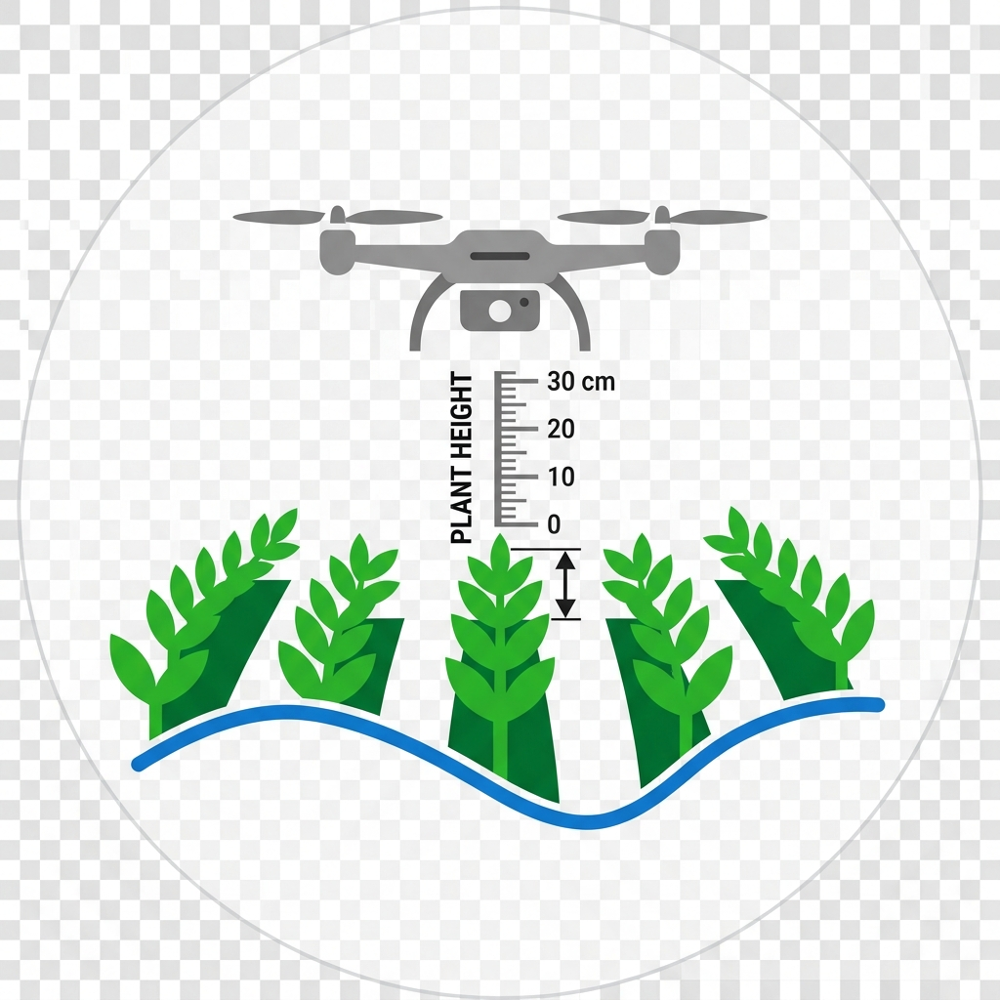

CVM (Canopy Volume Model): The calculated volume per pixel in cubic meters (m³).

  

  

🛠 Installation
Download or clone this repository.
Copy the microplot_generator folder into your local QGIS plugins directory: (e.g., C:\Users\YourUser\AppData\Roaming\QGIS\QGIS3\profiles\default\python\plugins).

## 1. Set Up Your Scene
Open QGIS and load your Orthomosaic or **Digital Surface Model (DSM)**
### 2. Launch the Plugin 🪄
Go to the **Raster Menu** and select **`Magic Canopy Model Generator - UAV`**. A clean, intuitive interface will appear.

### 3. Mark Ground Reference Points 📌
- Click the **"Mark Bare Soil Points"** button.
- Navigate your map and click areas where the actual soil is visible (field edges, paths, or between wide rows). 
- Each click captures the exact elevation (Z) of the terrain at that spot.
-
- 

### 4. Run the Magic (TPS + LOOCV) ⚡
Once you have marked the points for interpolation (we recommend ensuring sufficient representation across all areas), click "Run TPS Interpolation

The plugin uses the Thin Plate Spline (TPS) algorithm to interpolate the reference points and generate a continuous Digital Terrain Model (DTM) beneath the crop canopy.

It automatically performs Leave-One-Out Cross-Validation (LOOCV) to find the perfect smoothing balance.

### 5. Analyze Your Results 📏
Once processing is complete, 3 temporary RAM layers will appear in your Layers Panel:

DTM (Digital Terrain Model): The estimated soil surface.

CHM (Canopy Height Model): The true height of your plants (DSM - DTM).

CVM (Canopy Volume Model): The calculated volume per pixel (Height × Spatial Resolution).

---
## 💾 Saving Your Work
The generated layers live in your computer's RAM for maximum speed. If you want to keep them:
1. Select your preferred **Compression** (e.g., `DEFLATE` for very small files).
2. Click the **Save** button next to each product. 
3. The exported GeoTIFF will automatically re-load into your project for further analysis.
---

